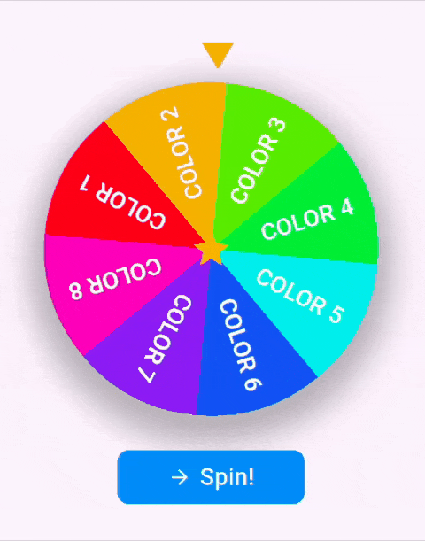

# gamification_wheel

A fully customizable, animated spinning wheel widget for Flutter. Perfect for games, rewards, decision-making, and interactive apps. **Not for gambling or betting purposes.**

---

## Features

- 🎯 Customizable segments (text, color, probability)
- 🎨 Modern Material 3 UI
- ⚡ Smooth, high-performance animations
- 🏆 Weighted probability (fair, customizable spins)
- 🖼️ Custom pointer and center widget
- 📱 Responsive (mobile, web, desktop)
- 🛠️ Easy integration, no external state management required
- 📝 Null safety and up-to-date Flutter support

---

## Demo



---

## Installation

Add to your `pubspec.yaml`:

```yaml
dependencies:
  gamification_wheel: ^0.1.2
```

Then run:
```bash
flutter pub get
```

---

## Quick Usage

```dart
import 'package:gamification_wheel/gamification_wheel.dart';

final segments = [
  WheelSegment(id: '1', text: 'Pizza', color: '#FF6B6B', probability: 2.0),
  WheelSegment(id: '2', text: 'Burger', color: '#4ECDC4', probability: 1.0),
  WheelSegment(id: '3', text: 'Sushi', color: '#45B7D1', probability: 1.0),
  // ... more segments
];

GWheel(
  segments: segments,
  wheelSize: 300,
  animationSpeed: 2.0,
  showPointer: true,
  enableTapToSpin: true,
  showCenterDot: true,
  showWheelShadow: true,
  centerWidget: Icon(Icons.star, size: 40, color: Colors.white),
  onFinish: (result) {
    print('You got: ${result.text}');
  },
)
```

---

## Customization

- **Wheel Size**: `wheelSize` (e.g. 200-400)
- **Animation Speed**: `animationSpeed` (0.5x to 3.0x)
- **Segment Colors**: Any hex color code
- **Probability**: Set different weights for each segment
- **Pointer & Center Widget**: Fully customizable
- **Styling**: Shadows, borders, font styles, and more

---

## Documentation & Changelog

- [API Reference](https://pub.dev/documentation/gamification_wheel/latest/)
- [Changelog](https://pub.dev/packages/gamification_wheel/changelog)
- [Example](https://github.com/Tahaylmz/gamification-wheel/tree/main/example)

---

## License

MIT License. See [LICENSE](https://github.com/Tahaylmz/gamification-wheel/blob/main/LICENSE).

---

## Contributing

Contributions are welcome! Please open an issue or submit a pull request on GitHub.

---

## ⚠️ Important Notice

> **This package is NOT intended for gambling, betting, or any real-money gaming purposes.**
> It is designed for gamification, education, entertainment, and decision-making apps only.

---
